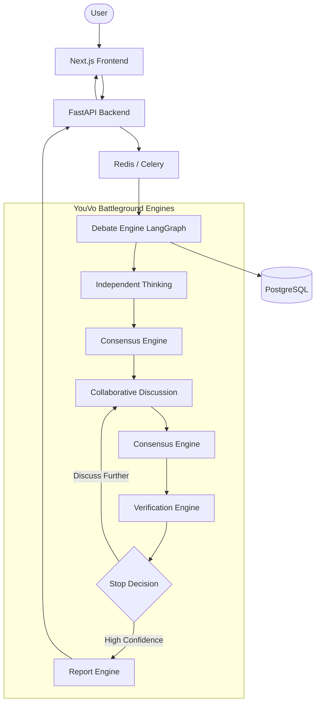

# YouVo Battleground

> Ask Better. Know Better.

YouVo Battleground is an intelligent reasoning platform where multiple AI models collaborate in the background to produce a single high-quality answer. It removes the need for humans to manually compare AI responses by utilizing a cyclical LangGraph-based engine to facilitate independent thinking, consensus building, debate, and verification.

---

## 🏛️ Architecture Overview



---

## ✨ Features

- **Multi-Model Collaboration**: Select from GPT, Claude, Gemini, DeepSeek, and more via a sleek Provider Accordion UI.
- **Custom Models**: Connect any OpenRouter or self-hosted model natively into the routing engine.
- **Autonomous Consensus**: Extracts agreements, disagreements, and open questions automatically.
- **Verification Engine**: Checks for logical contradictions and hallucinations.
- **Versioned Reporting**: Preserves all generated reports to track the evolution of the answer.
- **Interactive Follow-ups**: Deliberate further or challenge an answer without restarting the entire discussion.
- **Secure Key Management**: API keys are passed from the client securely and never logged or stored. Dynamic UI only requests keys for actively selected providers.

---

## 🛠️ Tech Stack

- **Frontend**: Next.js 15, React 19, TailwindCSS, Shadcn/ui
- **Backend**: FastAPI, SQLModel (SQLAlchemy), LiteLLM, LangGraph
- **Workers**: Celery, Redis
- **Database**: PostgreSQL
- **Monitoring**: Flower

---

## 📂 Folder Structure

```
.
├── backend/                  # FastAPI & Celery Application
│   ├── app/
│   │   ├── api/              # REST & WS Endpoints
│   │   ├── consensus/        # Consensus Extraction Engine
│   │   ├── debate/           # LangGraph Flow Coordinator
│   │   ├── memory/           # Memory State Management
│   │   ├── models/           # SQLModel Database Entities
│   │   ├── prompts/          # AI Prompt Instructions
│   │   ├── providers/        # LiteLLM Gateway
│   │   ├── report/           # Final JSON Report Generator
│   │   ├── stop/             # Debate Stop Condition Logic
│   │   └── verification/     # QA & Hallucination Check
├── frontend/                 # Next.js Application
│   ├── src/app/              # Pages (Home, Discussion Viewer)
│   └── src/components/       # UI Components
├── scripts/                  # Helper Bash Scripts
├── docker-compose.yml        # Docker Orchestration
└── Makefile                  # Dev Commands
```

---

## 🚀 Quickstart

### Prerequisites
- [Docker & Docker Compose](https://www.docker.com/) installed on your machine.
- Valid API keys for the models you wish to use.

### 1. Environment Setup
Copy the environment files and populate them if necessary (default settings work out of the box for local Docker).
```bash
cp .env.example .env
cp backend/.env.example backend/.env
cp frontend/.env.example frontend/.env
```

### 2. Run the Application
Use the provided Makefile to spin up the entire cluster in development mode:
```bash
make up
```

This starts:
- **PostgreSQL**: `localhost:5432`
- **Redis**: `localhost:6379`
- **FastAPI**: `localhost:8000` (Swagger docs at `/docs`)
- **Celery Worker**: Background processes
- **Flower**: `localhost:5555` (Task monitoring)
- **Next.js UI**: `localhost:3000`

### 3. Open the Dashboard
Navigate to [http://localhost:3000](http://localhost:3000) and enter the Battleground!

---

## 💻 Local Development

### Makefile Commands
- `make up`: Start all services in the background.
- `make down`: Stop all services.
- `make logs`: Stream logs for all services.
- `make rebuild`: Force a full rebuild of the containers.
- `make migrate`: Run Alembic database migrations.
- `make clean`: Wipe all volumes, databases, and caches.

### Scripts
Alternatively, use the bash scripts located in `/scripts`:
- `./scripts/dev.sh`: Starts dev mode.
- `./scripts/start.sh`: Starts production profile.
- `./scripts/reset.sh`: Cleans state.

---

## 🛣️ Future Roadmap

- [ ] User Accounts & Authentication
- [ ] Shareable Public Discussion Links
- [ ] Stripe Payment Integration
- [ ] Custom Agent Injection
- [ ] Browser Extension
